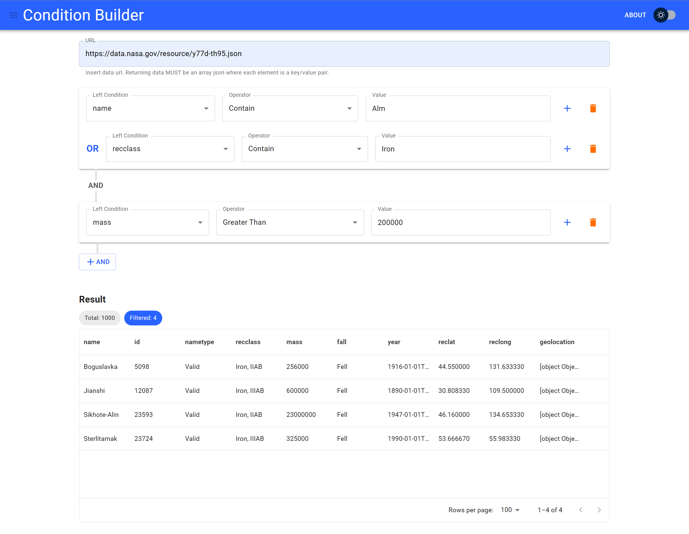

# Condition Builder

[](https://github.com/prettier/prettier)

> &nbsp;
> This take-home project is called the **Condition Builder**.
> This tool allows you to load an array of data and layer in _and_/_or_ conditions to filter the data.
> &nbsp;



### <u>Features</u>

- [x] User can load array of data from an URL.
      **Example URL:** https://data.nasa.gov/resource/y77d-th95.json
- [x] User can build **or** conditions concatenated with **and** conditions.
  - For an example, any `c{n}` resolved to be a boolean (ex. name equals to "something"), then the condition can be formed as `(c1 || c2 || c3) && (c4 || c5)`.
- [x] User can add `or` condition by pressing the plus button at the end of each row.
- [x] User can add `and` condition by pressing the and button below each card container.
- [x] User can see the list of loaded data on the bottom of the page.
- [x] User can see the filtered data list when valid conditions are built.
- [x] Visual feedback on where new `or` condition will be inserted when user hover over plus button (optional)
- [x] Input validations
  - For comparison operators (Greater Than, Less Than), the entered value must be number.

### <u>Tools/Languages</u>

- **Dev Enviroment/Build Tool**
  - [Vite](https://vitejs.dev/)
- **UI Framework/Language**
  - [React](https://react.dev/) / [TypeScript](https://www.typescriptlang.org/)
- **Design System**
  - [Material UI (MUI)](https://mui.com/)
- **Unit Testing**
  - [Jest](https://jestjs.io/)

### <u>Potential Improvements/Enhancements</u>

If this application was intended for production/at scale, I would include the following:

- :on: Add E2E [cypress](https://www.cypress.io/) tests.
- :chart_with_upwards_trend: Add code-coverage checks to build process to ensure coverage remains at/above a pre-determined level (That said, more unit tests :smiley:)
- :white_check_mark: Implement/expand validation using [joi](https://joi.dev/) or [yup](https://github.com/jquense/yup#yup).
- :earth_americas: Support language localization using [react-intl](https://formatjs.io/docs/react-intl/#the-react-intl-package).
  - :scissors: Extract language strings to centralized location.
- 📦 Semantic versioning
- :dragon::droplet: Allow drag/drop of conditions to change order/sequence.
- :cloud: Allow user to save/load conditions to either `localStorage` or in the cloud.
- :books: Refactor theme/styles into a lib
- :x: Improve error handling/checking e.g:
  - :triangular_flag_on_post: when user enters a bad url
  - :triangular_flag_on_post: the request for a valid url fails
  - :triangular_flag_on_post: the response from the url is not a valid key/value pair

### <u>How To Run</u>

##### Requirements:

- `node` >= v14.21.3

##### Starting the App:

First, clone the repository locally, then run the following:

```shell
$ npm install # Install dependencies (required for every step hereafter)
$ npm run dev # Start the development server
```

##### Create Production Build:

```shell
$ npm run build # Required for preview task below
```

##### Preview Production Build:

```shell
$ npm run preview
```

##### Running Tests:

```shell
$ npm run unit-test
```

##### Running Linter:

```shell
$ npm run lint
```
